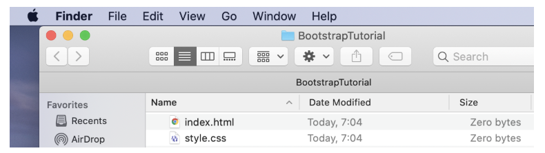
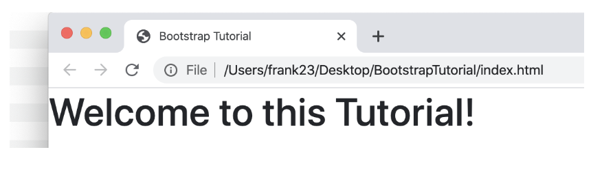
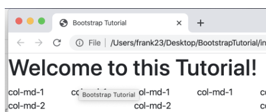
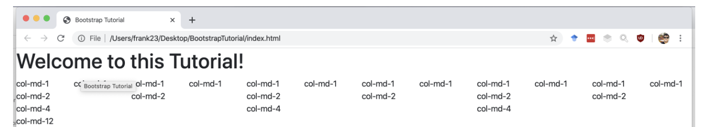
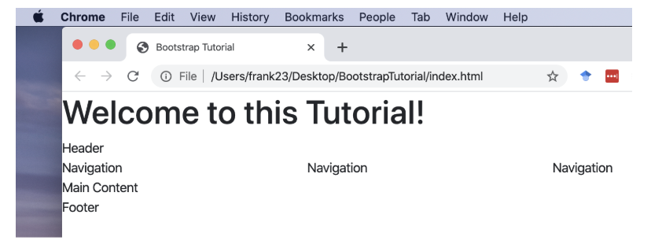
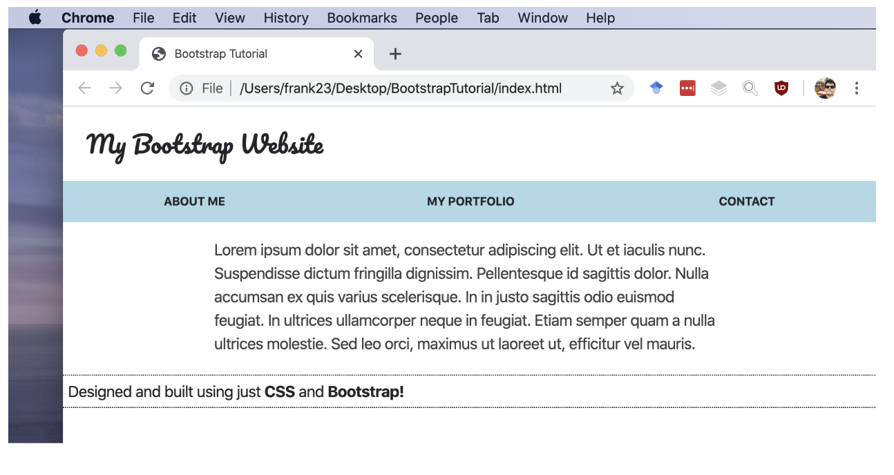
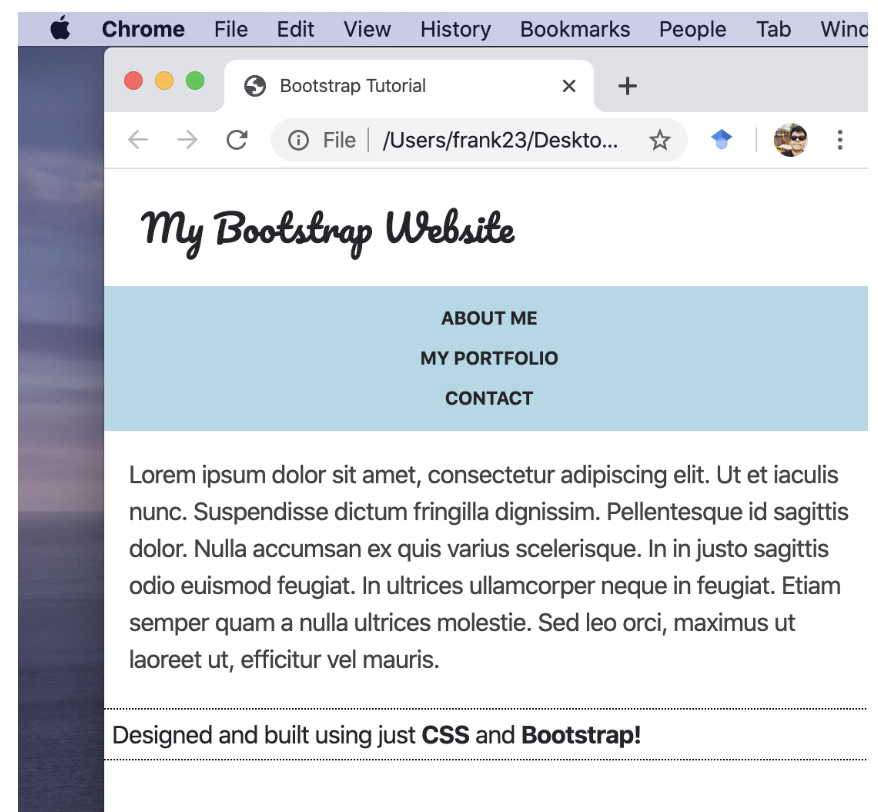
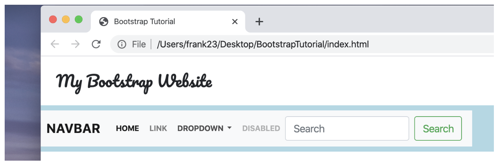
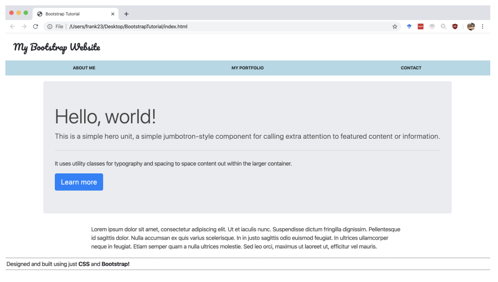

# BootstrapTutorial

Welcome to this tutorial session of Bootstrap!

In this tutorial we learn how to
 - Create a basic bootstrap page
 - Create grid layouts
 - Create a responsive website
 - Combine bootstrap code snippets to create a website

## Initial Setup
First, we are going to get ready to start using bootstrap. Create a folder named BootstrapTutorial with an index.html file, also to help with styling, we are going to need a style.css file.



Let’s start first with the index.html file where we are going to add the following BootstrapCDN:

```HTML
<!doctype html>
<html lang="en">
  <head>
    <!-- Required meta tags -->
    <meta charset="utf-8">
    <meta name="viewport" content="width=device-width, initial-scale=1, shrink-to-fit=no">
    <link rel="stylesheet" href="style.css?v=1.0">
    <!-- Bootstrap CSS -->
    <link rel="stylesheet" href="https://stackpath.bootstrapcdn.com/bootstrap/4.4.1/css/bootstrap.min.css" integrity="sha384-Vkoo8x4CGsO3+Hhxv8T/Q5PaXtkKtu6ug5TOeNV6gBiFeWPGFN9MuhOf23Q9Ifjh" crossorigin="anonymous">
    <title>Bootstrap Tutorial</title>
  </head>
  <body>
    <h1>Welcome to this Tutorial!</h1>

    <!-- Optional JavaScript -->
    <!-- jQuery first, then Popper.js, then Bootstrap JS -->
    <script src="https://code.jquery.com/jquery-3.4.1.slim.min.js" integrity="sha384-J6qa4849blE2+poT4WnyKhv5vZF5SrPo0iEjwBvKU7imGFAV0wwj1yYfoRSJoZ+n" crossorigin="anonymous"></script>
    <script src="https://cdn.jsdelivr.net/npm/popper.js@1.16.0/dist/umd/popper.min.js" integrity="sha384-Q6E9RHvbIyZFJoft+2mJbHaEWldlvI9IOYy5n3zV9zzTtmI3UksdQRVvoxMfooAo" crossorigin="anonymous"></script>
    <script src="https://stackpath.bootstrapcdn.com/bootstrap/4.4.1/js/bootstrap.min.js" integrity="sha384-wfSDF2E50Y2D1uUdj0O3uMBJnjuUD4Ih7YwaYd1iqfktj0Uod8GCExl3Og8ifwB6" crossorigin="anonymous"></script>
  </body>
</html>
```

Save and open the file, you should see this when opening the index.html file with your browser:



Create a Basic Grid Layout
Bootstrap requires you to have a grid consisting of up-to 12 columns. Remember that you need to break this down by the number of columns you want to use. For example, for a 3-column layout, each column needs to be 4 units wide. Also, your columns need to be wrapped in a row, just like in a table.
Place the cursor in the <body> of your document, after the h1. Let’s add a row first, with some size-1 columns:

```HTML
<body>
  <h1>Welcome to this Tutorial!</h1>

  <div class="row">
    <div class="col-md-1">col-md-1</div>
    <div class="col-md-1">col-md-1</div>
    <div class="col-md-1">col-md-1</div>
  </div>

Now, let’s explore the grid layout by adding different sizes:

<body>
  <h1>Welcome to this Tutorial!</h1>

  <div class="row">
    <div class="col-md-1">col-md-1</div>
    <div class="col-md-1">col-md-1</div>
    <div class="col-md-1">col-md-1</div>
    <div class="col-md-1">col-md-1</div>
    <div class="col-md-1">col-md-1</div>
    <div class="col-md-1">col-md-1</div>
    <div class="col-md-1">col-md-1</div>
    <div class="col-md-1">col-md-1</div>
    <div class="col-md-1">col-md-1</div>
    <div class="col-md-1">col-md-1</div>
    <div class="col-md-1">col-md-1</div>
    <div class="col-md-1">col-md-1</div>
  </div>

  <div class="row">
    <div class="col-md-2">col-md-2</div>
    <div class="col-md-2">col-md-2</div>
    <div class="col-md-2">col-md-2</div>
    <div class="col-md-2">col-md-2</div>
    <div class="col-md-2">col-md-2</div>
    <div class="col-md-2">col-md-2</div>
  </div>

  <div class="row">
    <div class="col-md-4">col-md-4</div>
    <div class="col-md-4">col-md-4</div>
    <div class="col-md-4">col-md-4</div>
  </div>

  <div class="row">
    <div class="col-md-12">col-md-12</div>
  </div>
```
You should see Bootstrap working the grid layout in your browser.



### Task:
Experiment with new rows with different units wide. What do you get?
### Create a responsive layout
Bootstrap can change the width of the column depending on the browser window’s size. For example, on large screens, a row has 4 columns, on small screens it has 2 columns, on extra small screens it has 1 column.
You can target these screen sizes separately via the prefixes xs, sm, md, lg. These are then followed by a number. denoting the number of units this column should take up when the browser window is extra small, small, medium, large. 

Example, insert two rows with different column sizes.

```HTML
<body>
  <h1>Welcome to this Tutorial!</h1>

  <div class="row">
    <div class="col-xs-12 col-md-8">col-xs-12 col-md-8</div>
    <div class="col-xs-6 col-md-4">col-xs-6 col-md-4</div>
  </div>

  <div class="row">
    <div class="col-xs-6 col-md-4">col-xs-6 col-md-4</div>
    <div class="col-xs-6 col-md-4">col-xs-6 col-md-4</div>
    <div class="col-xs-6 col-md-4">col-xs-6 col-md-4</div>
  </div>
```

For more options and information regarding layouts, check out the bootstrap documentation:
https://getbootstrap.com/docs/3.3/css/#grid
Create a Website from Scratch!
Ok, now we know how to create columns, let us build a quick website. Our basic layout has 4 rows.
First row (Website Header): should be 12 units wide (one column).
Second row (Navigator): should have 3 columns. 
Third row (main content): should have one column.
Fourth row (Website Footer): Should always be 12 units wide (one column).
After setting up your layout, your website should look like this:



Let’s customise the website a bit, add some customized content and CSS styling.
Example:
HTML Code:
```HTML
<!doctype html>
<html lang="en">
<head>
  <!-- Required meta tags -->
  <meta charset="utf-8">
  <meta name="viewport" content="width=device-width, initial-scale=1, shrink-to-fit=no">
  <link rel="stylesheet" href="style.css?v=1.0">
  <!-- Bootstrap CSS -->
  <link rel="stylesheet" href="https://stackpath.bootstrapcdn.com/bootstrap/4.4.1/css/bootstrap.min.css" integrity="sha384-Vkoo8x4CGsO3+Hhxv8T/Q5PaXtkKtu6ug5TOeNV6gBiFeWPGFN9MuhOf23Q9Ifjh" crossorigin="anonymous">
  <title>Bootstrap Tutorial</title>
</head>
<body>
  <div class="row">
    <div class="header col-xs-12 col-md-8">
      <h1>My Bootstrap Website</h1>
    </div>
  </div>

  <div class="row navigation">
    <div class="nav col-xs-6 col-md-4">About Me</div>
    <div class="nav col-xs-6 col-md-4">My Portfolio</div>
    <div class="nav col-xs-6 col-md-4">Contact</div>
  </div>

  <div class="row content">
    <div class="col-xs-12 col-md-8">Lorem ipsum dolor sit amet, consectetur adipiscing elit. Ut et iaculis nunc. Suspendisse dictum fringilla dignissim. Pellentesque id sagittis dolor. Nulla accumsan ex quis varius scelerisque. In in justo sagittis odio euismod feugiat. In ultrices ullamcorper neque in feugiat. Etiam semper quam a nulla ultrices molestie. Sed leo orci, maximus ut laoreet ut, efficitur vel mauris.</div>
  </div>

  <div class="row footer">
    <div class="col-xs-12 col-md-8">Designed and built using just <span>CSS</span> and <span>Bootstrap!</span></div>
  </div>


  <!-- Optional JavaScript -->
  <!-- jQuery first, then Popper.js, then Bootstrap JS -->
  <script src="https://code.jquery.com/jquery-3.4.1.slim.min.js" integrity="sha384-J6qa4849blE2+poT4WnyKhv5vZF5SrPo0iEjwBvKU7imGFAV0wwj1yYfoRSJoZ+n" crossorigin="anonymous"></script>
  <script src="https://cdn.jsdelivr.net/npm/popper.js@1.16.0/dist/umd/popper.min.js" integrity="sha384-Q6E9RHvbIyZFJoft+2mJbHaEWldlvI9IOYy5n3zV9zzTtmI3UksdQRVvoxMfooAo" crossorigin="anonymous"></script>
  <script src="https://stackpath.bootstrapcdn.com/bootstrap/4.4.1/js/bootstrap.min.js" integrity="sha384-wfSDF2E50Y2D1uUdj0O3uMBJnjuUD4Ih7YwaYd1iqfktj0Uod8GCExl3Og8ifwB6" crossorigin="anonymous"></script>
</body>
</html>
```
CSS Code:
```css
.header h1 {
  font-size: 24px;
  font-family: pacifico, sans-serif;
  margin: 24px;
}

.navigation {
  font-size: 12px;
  text-transform: uppercase;
  font-weight: bold;
  background: lightblue;
  text-align: center;
  padding: 8px;
  cursor: pointer;
}

.navigation .nav {
  padding: 4px;
  justify-content: center;
}

.navigation .nav:hover {
  text-decoration: underline;
  color: white;
}

.content {
  padding: 16px;
  color: #424242;
  justify-content: center;
}

.footer {
  padding: 4px;
  margin: 4px;
  border: 1px dotted black;
}

.footer span {
  font-weight: bold;
}
```
### Task:
Experiment customizing your website feel free to create your own style or layout.



## Use Bootstrap Components!
Update your own website using bootstrap components!

### Menu
Go to the bootstrap site and find the Navbar code (the menu is on the right). Copy the code and paste it into your second row. You now have a menu!  Open your html fill in a browser and look at the results.

### Jumbotron
Time to put something exciting onto the page! Find the code for the Jumbotron and paste it into row 3 (content). 
https://getbootstrap.com/docs/4.4/components/jumbotron/


### Thumbnails
Go to the Thumbnail content type and copy the code. Paste one block of code into each of the three columns in a new row, so you have 3 thumbnails next to each other (on large screens).
https://getbootstrap.com/docs/4.4/content/images/#image-thumbnails



### Cards
Get the code for the Card, and create a new row with one column before the footer. Save the html file, reload it in the browser and take a look.


## What Now?
Ok! So now you have a basic Website. However, there are a lot of other elements for you to try out. Start by adding descriptions to the thumbnails or buttons. Maybe extend the navigation and edit the text in the Jumbotron too?
In addition, create more rows and play with the other content types. Try Alert, Badges, Wells, Dropdowns and Media Object. Play with different column widths to combine 2 or three items in one row.

The code of this tutorial is available on github:
https://github.com/FranciscoGutierrez/BootstrapTutorial

Demo:
https://franciscogutierrez.github.io/BootstrapTutorial/


